# Maximum Likelihood Estimation

Maximum Likelihood Estimation (MLE) is one of the central ideas in statistics and machine learning. The idea is simple: MLE chooses the parameters that make the data we actually observed most likely under the model.

If you toss a coin 10 times and observe 7 heads, a reasonable guess is that the probability of heads is close to 0.7. MLE turns that intuition into a precise optimization problem.

## Intuition: fit the parameter to the data

Suppose a coin lands heads with probability $\theta$. After $n$ tosses, you observe $k$ heads. MLE asks:

> Which value of $\theta$ makes this exact outcome most likely?

The interactive chart below shows that for $n = 10$ and $k = 7$, the likelihood peaks at $\theta = 0.7$. If you keep the same ratio but increase the sample size, for example $n = 20$ and $k = 14$, the peak stays in the same place while the curve becomes narrower. More data means more certainty.

<iframe src="mle_coin_intuition.html" width="100%" height="560" style="border: 1px solid #d0d7de; border-radius: 12px; background: #fff;" loading="lazy"></iframe>

There is one subtle but important naming convention here. When $\theta$ is fixed, $P(\mathcal{D} \mid \theta)$ is the probability of the data. When the observed data $\mathcal{D}$ are fixed and we vary $\theta$, the same expression is viewed as a function of the parameter. That function is called the **likelihood**.

## Formal definition

Let the dataset be $\mathcal{D} = \{x_1, \dots, x_n\}$ and let the model depend on parameters $\theta$.

The **likelihood function** is the probability, or probability density for continuous data, of observing the data under those parameters:

$$
\mathcal{L}(\theta) = P(\mathcal{D} \mid \theta) = \prod_{i=1}^{n} P(x_i \mid \theta)
$$

The product appears because we usually assume the observations are independent.

The **maximum likelihood estimate** is the parameter value that maximizes this function:

$$
\hat{\theta}_{\text{MLE}} = \arg\max_{\theta} \mathcal{L}(\theta)
$$

## Why we use the log-likelihood

In practice, multiplying many small probabilities quickly produces numbers that underflow to zero in floating-point arithmetic. That is why we maximize the log-likelihood instead:

$$
\ell(\theta) = \log \mathcal{L}(\theta) = \sum_{i=1}^{n} \log P(x_i \mid \theta)
$$

This helps for two reasons:

- The logarithm is monotonic, so it does not change the location of the maximum.
- Products become sums, which are easier to analyze, differentiate, and optimize.

<iframe src="likelihood_vs_loglikelihood.html" width="100%" height="560" style="border: 1px solid #d0d7de; border-radius: 12px; background: #fff;" loading="lazy"></iframe>

## MLE for a coin: analytic derivation

For one toss, encode heads as $x_i = 1$ and tails as $x_i = 0$. Under a Bernoulli model with probability of heads $\theta$, the probability of the observed result is

$$
P(x_i \mid \theta) = \theta^{x_i}(1-\theta)^{1-x_i}
$$

This compact formula gives $\theta$ when $x_i = 1$ and $1-\theta$ when $x_i = 0$.

For a full observed sequence $\mathcal{D} = (x_1, \dots, x_n)$, independence gives

$$
\mathcal{L}(\theta)
= P(\mathcal{D} \mid \theta)
= \prod_{i=1}^{n} \theta^{x_i}(1-\theta)^{1-x_i}
$$

If the sequence contains $k$ heads, then $\sum_i x_i = k$ and $\sum_i (1-x_i) = n-k$, so

$$
\mathcal{L}(\theta) = \theta^k(1-\theta)^{n-k}
$$

To turn this likelihood into a log-likelihood, we use three logarithm facts.

First, $\log$ is strictly increasing on positive numbers, so it preserves the maximizer:

$$
\mathcal{L}(\theta_1) > \mathcal{L}(\theta_2)
\quad \Longleftrightarrow \quad
\log \mathcal{L}(\theta_1) > \log \mathcal{L}(\theta_2)
$$

Therefore maximizing $\mathcal{L}(\theta)$ is equivalent to maximizing $\log \mathcal{L}(\theta)$.

Second, products become sums:

$$
\log(ab) = \log a + \log b
$$

Third, powers become multipliers:

$$
\log(a^c) = c\log a
$$

Apply them step by step:

$$
\begin{aligned}
\ell(\theta)
&= \log \mathcal{L}(\theta) \\
&= \log\left(\theta^k(1-\theta)^{n-k}\right) \\
&= \log(\theta^k) + \log\left((1-\theta)^{n-k}\right) \\
&= k \log \theta + (n-k) \log(1-\theta)
\end{aligned}
$$

This is the log-likelihood of one particular sequence with $k$ heads and $n-k$ tails. If we instead ask for the probability of seeing exactly $k$ heads in any order, the likelihood includes the binomial coefficient $\binom{n}{k}$. That coefficient does not depend on $\theta$, so it does not affect which value of $\theta$ maximizes the likelihood.

Differentiate with respect to $\theta$ and set the derivative to zero:

$$
\frac{d\ell}{d\theta} = \frac{k}{\theta} - \frac{n-k}{1-\theta} = 0
$$

Solve for $\theta$:

$$
\frac{k}{\theta} = \frac{n-k}{1-\theta}
$$

$$
k(1-\theta) = (n-k)\theta
$$

$$
k - k\theta = n\theta - k\theta
$$

$$
k = n\theta
$$

$$
\boxed{\hat{\theta}_{\text{MLE}} = \frac{k}{n}}
$$

So the familiar sample proportion is not just intuition. It is the exact maximum likelihood solution.

## MLE for a Gaussian distribution

Now consider continuous data such as heights, weights, or measurement errors. Assume the data are independently sampled from a Gaussian distribution:

$$
x_i \sim \mathcal{N}(\mu, \sigma^2)
$$

The density of one observation is

$$
P(x_i \mid \mu, \sigma) = \frac{1}{\sigma\sqrt{2\pi}} \exp\!\left(-\frac{(x_i - \mu)^2}{2\sigma^2}\right)
$$

For continuous variables, this value is a probability density, not the probability of observing exactly one point. Exact points have probability zero in continuous distributions. MLE still works the same way: it chooses the parameters that give the observed sample the highest joint density.

For the full dataset, the log-likelihood is

$$
\ell(\mu, \sigma) = -\frac{n}{2}\log(2\pi\sigma^2) - \frac{1}{2\sigma^2}\sum_{i=1}^{n}(x_i - \mu)^2
$$

Maximizing with respect to $\mu$ gives

$$
\hat{\mu}_{\text{MLE}} = \frac{1}{n}\sum_{i=1}^{n} x_i
$$

Maximizing with respect to $\sigma^2$ gives

$$
\hat{\sigma}^2_{\text{MLE}} = \frac{1}{n}\sum_{i=1}^{n}(x_i - \hat{\mu})^2
$$

That is why the sample mean naturally appears as the MLE of the Gaussian mean. Notice that the MLE variance uses $1/n$, not $1/(n-1)$. The latter is the unbiased estimator, which is a different objective.

<iframe src="mle_gaussian_fitting.html" width="100%" height="620" style="border: 1px solid #d0d7de; border-radius: 12px; background: #fff;" loading="lazy"></iframe>

With small samples, the fitted curve can differ noticeably from the true distribution. As the sample size grows, the estimate stabilizes and approaches the true parameter values. This is one expression of **consistency**.

## From MLE to common loss functions

MLE is not an isolated topic. It directly explains why several standard machine learning losses look the way they do.

### Logistic regression and cross-entropy

For binary classification, each label $y_i \in \{0, 1\}$ is modeled as a Bernoulli random variable with predicted probability $\hat{p}_i$:

$$
P(y_i \mid x_i, \mathbf{w}) = \hat{p}_i^{y_i}(1-\hat{p}_i)^{1-y_i}
$$

The log-likelihood over the dataset is

$$
\ell(\mathbf{w}) = \sum_{i=1}^{n} \left[y_i \log \hat{p}_i + (1-y_i) \log(1-\hat{p}_i)\right]
$$

If we negate this expression, maximizing likelihood becomes minimizing a loss. That loss is exactly **binary cross-entropy**.

### Linear regression and mean squared error

If a regression model assumes Gaussian noise around the prediction,

$$
y_i = f(x_i) + \varepsilon_i, \qquad \varepsilon_i \sim \mathcal{N}(0, \sigma^2)
$$

then maximizing the Gaussian likelihood is equivalent to minimizing the sum of squared errors. This is the probabilistic origin of **mean squared error (MSE)**.

## Key properties of MLE

MLE is popular because, under standard regularity assumptions, it has several strong asymptotic properties:

These are long-run guarantees. They explain why MLE is so widely used, but they do not mean every small dataset gives an unbiased or highly accurate estimate.

- **Consistency**: as $n \to \infty$, the estimate converges to the true parameter.
- **Asymptotic normality**: for large samples, the estimate is approximately Gaussian around the true value.
- **Asymptotic efficiency**: it achieves the lowest possible variance among a broad class of estimators.
- **Invariance**: if $\hat{\theta}$ is the MLE of $\theta$, then $g(\hat{\theta})$ is the MLE of $g(\theta)$ for a transformation $g$.

<iframe src="mle_properties_stepper.html" width="100%" height="520" style="border: 1px solid #d0d7de; border-radius: 12px; background: #fff;" loading="lazy"></iframe>

## Summary table

| Question | Answer |
| --- | --- |
| What do we maximize? | $\mathcal{L}(\theta) = \prod_i P(x_i \mid \theta)$ |
| Why use a logarithm? | Numerical stability and easier optimization |
| How do we solve it? | Analytically when possible, otherwise with gradient-based optimization |
| Where does cross-entropy come from? | MLE for a Bernoulli model |
| Where does mean squared error come from? | MLE for Gaussian noise |
| How does regularization fit in? | It appears naturally in Maximum A Posteriori (MAP) estimation through a prior |

## Self-check questions

Use these questions to check whether the main ideas are clear before moving on.

<iframe src="mle_self_check_questions.html" width="100%" height="430" style="border: 1px solid #d0d7de; border-radius: 12px; background: #fff;" loading="lazy"></iframe>

## Common interview questions

These are the versions of MLE questions that often appear in machine learning and statistics interviews.

<iframe src="mle_interview_questions.html" width="100%" height="540" style="border: 1px solid #d0d7de; border-radius: 12px; background: #fff;" loading="lazy"></iframe>

## Where these ideas reappear

- **Regression losses**: linear regression with Gaussian noise leads to mean squared error.
- **Classification losses**: logistic regression and softmax classification lead to binary and categorical cross-entropy.
- **Probabilistic models**: Naive Bayes, Gaussian Mixture Models, Hidden Markov Models, probabilistic PCA, and factor analysis all use likelihood-based fitting.
- **Latent-variable models**: Expectation-Maximization (EM) maximizes likelihood when some variables are not directly observed.
- **Regularized estimation**: Maximum A Posteriori (MAP) extends MLE by adding a prior, which links probabilistic estimation to L1 and L2 regularization.
- **Deep learning and generative modeling**: many standard losses are negative log-likelihoods under a chosen output distribution, while models such as autoregressive models and normalizing flows optimize likelihood directly.
